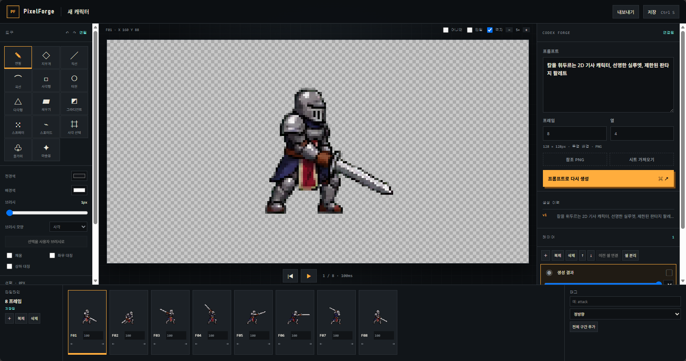

# PixelForge

ChatGPT 구독 기반 Codex 생성과 정밀 픽셀 편집, 게임 엔진 내보내기를 하나의 로컬 워크플로로 묶은 캐릭터 스프라이트 제작 도구입니다.


<p align="center">
  
</p>

## 주요 기능

- **Codex 이미지 생성** — 자연어 프롬프트와 참조 PNG로 스프라이트 시트를 생성하고 프레임으로 가져옵니다.
- **픽셀 편집 도구** — 연필, 지우개, 선, 곡선, 도형, 채우기, 그라디언트, 스프레이, 대칭 그리기와 사용자 브러시를 제공합니다.
- **선택과 변형** — 사각 선택, 올가미, 마술봉으로 고른 픽셀을 이동·반전·회전·확대할 수 있습니다.
- **애니메이션 타임라인** — 프레임 복제·삭제·정렬, 재생 시간과 순방향·역방향·핑퐁 태그를 관리합니다.
- **레이어와 팔레트** — 불투명도, 잠금, 혼합 모드, 연결 셀, RGBA와 최대 256색 인덱스 팔레트를 지원합니다.
- **게임 엔진 내보내기** — 범용 PNG/JSON, Godot 4 `SpriteFrames`, Unity 스프라이트·`AnimationClip` 묶음을 생성합니다.

## 요구사항

- Node.js 20.19 이상
- ChatGPT에 로그인된 Codex CLI
- `imagegen` 스킬을 사용할 수 있는 Codex 환경

PixelForge는 API 키 입력 대신 로컬 Codex App Server의 ChatGPT 로그인을 사용합니다.

## 시작하기

```bash
git clone git@github.com:KindTis/PixelForge.git
cd PixelForge
npm install
npm run dev
```

브라우저에서 <http://127.0.0.1:5173>을 엽니다. 개발 서버와 API 서버는 로컬 루프백 주소에서만 실행됩니다.

## 명령어

| 명령어 | 설명 |
| --- | --- |
| `npm run dev` | Vite 개발 서버와 PixelForge API 서버를 함께 실행합니다. |
| `npm run build` | TypeScript를 검사하고 프로덕션 클라이언트를 빌드합니다. |
| `npm start` | 빌드된 클라이언트와 API 서버를 실행합니다. |
| `npm test` | Node.js 기반 전체 테스트를 실행합니다. |

## 프로젝트 데이터

프로젝트와 생성 결과, 참조 이미지, 가져온 시트, 내보내기 결과는 `projects/<프로젝트 ID>/` 아래에 로컬로 저장됩니다. `projects/`는 Git에서 제외됩니다.

## 구조

```text
src/client/   React UI와 픽셀 편집 작업 공간
src/core/     스프라이트 문서, 래스터, 선택, 애니메이션 로직
src/server/   로컬 API, Codex 연결, 프로젝트 저장, 엔진 내보내기
tests/        핵심 로직과 서버 흐름 테스트
```

## 라이선스

[MIT License](LICENSE)
